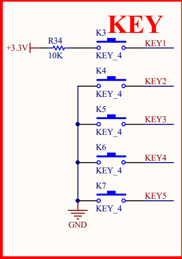

# Button

该例程将使用按钮实现对一个LED的控制

例程: [Button](./../../src/Standard_Lib/Button/)

## 代码

```c
#include "stm32f10x.h"

#define LED_PERIPH RCC_APB2Periph_GPIOB
#define LED_PORT GPIOB
#define LED_PIN GPIO_Pin_12

#define KEY_PERIPH RCC_APB2Periph_GPIOA
#define KEY_PORT GPIOA
#define KEY_PIN GPIO_Pin_2                                                              

void delay(int x)
{
    for (int i = 0; i < x; i++){
        for (int j = 0; j < 1000; j++)
            __NOP();
    }
}


int main() {
    TIM2_Init();

    GPIO_InitTypeDef gpioDef_led;
    GPIO_InitTypeDef gpioDef_key;
    RCC_APB2PeriphClockCmd(LED_PERIPH, ENABLE);
    RCC_APB2PeriphClockCmd(KEY_PERIPH, ENABLE);

    gpioDef_led.GPIO_Mode = GPIO_Mode_Out_PP;
    gpioDef_led.GPIO_Pin = LED_PIN;
    gpioDef_led.GPIO_Speed = GPIO_Speed_50MHz;

    gpioDef_key.GPIO_Mode = GPIO_Mode_IPU;
    gpioDef_key.GPIO_Pin = KEY_PIN;
    gpioDef_key.GPIO_Speed = GPIO_Speed_50MHz;

    GPIO_Init(LED_PORT, &gpioDef_led);
    GPIO_Init(KEY_PORT, &gpioDef_key);

    GPIO_WriteBit(LED_PORT, LED_PIN, Bit_RESET);
    GPIO_WriteBit(KEY_PORT, KEY_PIN, Bit_SET);

    while (1) { 
        if ((BitAction)GPIO_ReadInputDataBit(KEY_PORT, KEY_PIN) == Bit_RESET) {
            delay(30);
            if ((BitAction)GPIO_ReadInputDataBit(KEY_PORT, KEY_PIN) == Bit_RESET) { 
                GPIO_WriteBit(LED_PORT, LED_PIN, (BitAction)!GPIO_ReadInputDataBit(LED_PORT, LED_PIN));
                while ((BitAction)GPIO_ReadInputDataBit(KEY_PORT, KEY_PIN) == Bit_RESET);
            }
        }
    }
}
```

## 代码分析

在代码中, 我们使用了GPIO口对PA12针脚进行了初始化, 并且在`while`循环中, 通过判断PA2按钮的电平, 对PA12针脚进行了取反操作, 从而实现了对LED灯的控制

本次例程的大部分代码已在上次例程中讲解过, 这里不再重复

我们只关注While部分和GPIO_Mode_IPU

### GPIO_Mode_IPU

GPIO_Mode_IPU是GPIO的一种模式, 代表了GPIO的输入模式, IPU是Input Pull Up的缩写, 即输入上拉

观看[此视频](https://www.bilibili.com/video/BV1Z84y157dx?t=65.4), 了解GPIO的输入模式

视频已精确定位

打开我们开发板的电路部分



如上图, 我们可以看到, KEY1的一端接到了3.3v, 而剩下的KEY均接到了GND, 按照视频中的方法尝试自己进行分析

<details>
    <summary>点击查看答案</summary>

    观察KEY1, 按下后接通的是3.3v, 因此KEY1的输入模式为IPD, 即输入下拉
    而剩余的KEY均接到了GND, 因此剩余的KEY的输入模式为IPU, 即输入上拉

</details>

### While部分

```c
while (1) { 
    if ((BitAction)GPIO_ReadInputDataBit(KEY_PORT, KEY_PIN) == Bit_RESET) {
        delay(30);
        if ((BitAction)GPIO_ReadInputDataBit(KEY_PORT, KEY_PIN) == Bit_RESET) { 
            GPIO_WriteBit(LED_PORT, LED_PIN, (BitAction)!GPIO_ReadInputDataBit(LED_PORT, LED_PIN));
            while ((BitAction)GPIO_ReadInputDataBit(KEY_PORT, KEY_PIN) == Bit_RESET);
        }
    }
}
```


如图所示，并不是按钮一按下即刻就会变成低电平，而是会有一定的抖动，因此我们需要在程序中加入延时，以防止抖动, 在抖动时, cpu会不对电平做出判断, 等待抖动结束后, 再进行判断


```c 
while (1) {     // 循环
    if ((BitAction)GPIO_ReadInputDataBit(KEY_PORT, KEY_PIN) == Bit_RESET) {     // 按钮按下检测
        delay(30);    // 等待抖动结束
        if ((BitAction)GPIO_ReadInputDataBit(KEY_PORT, KEY_PIN) == Bit_RESET) {     // 确认按钮按下
            GPIO_WriteBit(LED_PORT, LED_PIN, (BitAction)!GPIO_ReadInputDataBit(LED_PORT, LED_PIN));     // LED取反
            while ((BitAction)GPIO_ReadInputDataBit(KEY_PORT, KEY_PIN) == Bit_RESET);   // 阻塞循环, 等待按钮释放
        }
    }
}
```

## 开发板观察

构建并烧录\
按按钮, LED会点亮或者熄灭

但奇怪的是, 有时候按下按钮, LED并不会改变状态, 甚至有时候按下按钮, LED会闪烁\
这是由于我们的的延时函数并不规范, 造成了延时时间不稳定, 从而导致了这种情况\

在下一个例程中, 我们会使用定时器来进行延时, 从而解决这个问题