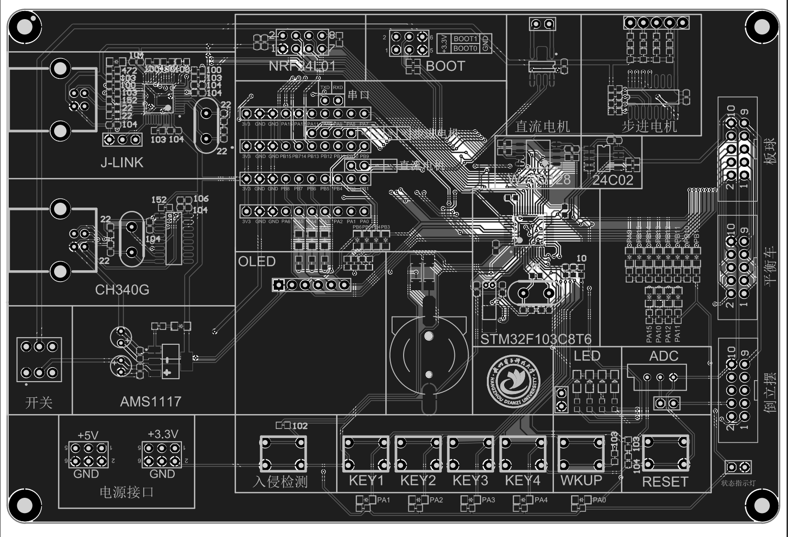

# First_LED

该项目将点亮开发板上的一个LED灯

例程: [Frist_LED](./../../src/Standard_Lib/First_LED/)

## 代码

```c
#include "stm32f10x.h"

#define LED_PERIPH RCC_APB2Periph_GPIOA
#define LED_PORT GPIOA
#define LED_PIN GPIO_Pin_1


void delay(int x)
{
    for (int i = 0; i < x; i++){
        for (int j = 0; j < 1000; j++)
            __NOP();
    }
}


int main()
{
    GPIO_InitTypeDef gpioDef;   // GPIO 初始化结构体
    RCC_APB2PeriphClockCmd(LED_PERIPH, ENABLE); // 使能GPIOA时钟
    gpioDef.GPIO_Mode = GPIO_Mode_Out_PP;   // 推挽输出
    gpioDef.GPIO_Pin = LED_PIN;        // LED引脚
    gpioDef.GPIO_Speed = GPIO_Speed_10MHz;  // GPIO速度
    GPIO_Init(LED_PORT, &gpioDef);   // 初始化GPIO

    while (1)
    {   
        GPIO_WriteBit(LED_PORT, LED_PIN, (BitAction)!GPIO_ReadInputDataBit(LED_PORT, LED_PIN));  
        delay(5000);
    }
}
```

## 开发板分析

观察开发板，找到`PA1`字样, 不难发现在下方`KEY1`的旁边



构建并烧录, 观察PA1的变化

可以看到, PA1的LED灯在不断的闪烁

## 代码分析

在代码中, 我们使用了GPIO口对PA1针脚进行了初始化, 并且在`while`循环中, 不断的对PA1进行了取反操作, 从而实现了LED灯的闪烁

这里`PA1`中的`P`代表了`Port`, 即端口, `A`代表了`GPIOA`, 即GPIOA端口, `1`代表了第一个引脚, 即PA1引脚

首先看到代码中的一个函数`delay`, delay在英语中的意思是延迟, 顾名思义, 这个函数就是用来延迟的

```c
// 延迟函数
void delay(int x) {     // 该函数有一个参数x, 用来表示需要延迟的时间，单位为毫秒，没有返回值因此为void
    for (int i = 0; i < x; i++){
        for (int j = 0; j < 1000; j++)
            __NOP();    // __NOP()是一个汇编指令，用来占用一个CPU周期，从而实现延迟，说白就是让cpu空转
    }
    // 它延迟了x*1000个CPU周期，我们姑且算一个CPU周期为1us，那么这个函数就是延迟了x*1000us，即x ms
    // 但实际上在生产中我们不使用这种延迟方式，现在就将就用吧
}
```

**注意: 该函数的延迟时间并不准确, 仅用于演示, 在实际开发中请使用定时器**

*注：1s=1000ms=1000000us，即1秒=1000毫秒=1000000微秒*

接下来看导入库和宏定义部分

```c
#include "stm32f10x.h"

#define LED_PERIPH RCC_APB2Periph_GPIOA
#define LED_PORT GPIOA
#define LED_PIN GPIO_Pin_1
```

这里定义了三个宏, 分别是`LED_PERIPH`, `LED_PORT`, `LED_PIN`

`LED_PERIPH`代表了LED的外设, 即LED所在的GPIO端口, 这里是GPIOA, 因此`LED_PERIPH`的值为`RCC_APB2Periph_GPIOA`

`LED_PORT`代表了LED的端口, 即LED所在的GPIO端口, 这里是GPIOA, 因此`LED_PORT`的值为`GPIOA`

`LED_PIN`代表了LED的引脚, 即LED所在的GPIO引脚, 这里是PA1, 因此`LED_PIN`的值为`GPIO_Pin_1`

`#include "stm32f10x.h"`是导入了STM32F10X的库, 该库包含了STM32F10X的所有寄存器定义, 以及一些常用的函数

例如此处的`RCC_APB2Periph_GPIOA`就是在`stm32f10x.h`中定义的, 该宏的值为`0x00000004`, 代表了GPIOA的时钟地址

按住`Ctrl`键, 点击`RCC_APB2Periph_GPIOA`可以跳转到`stm32f10x.h`中的定义

如下

```c
#define RCC_APB2Periph_AFIO              ((uint32_t)0x00000001)
#define RCC_APB2Periph_GPIOA             ((uint32_t)0x00000004)
#define RCC_APB2Periph_GPIOB             ((uint32_t)0x00000008)
#define RCC_APB2Periph_GPIOC             ((uint32_t)0x00000010)
#define RCC_APB2Periph_GPIOD             ((uint32_t)0x00000020)
#define RCC_APB2Periph_GPIOE             ((uint32_t)0x00000040)
#define RCC_APB2Periph_GPIOF             ((uint32_t)0x00000080)
#define RCC_APB2Periph_GPIOG             ((uint32_t)0x00000100)
#define RCC_APB2Periph_ADC1              ((uint32_t)0x00000200)
#define RCC_APB2Periph_ADC2              ((uint32_t)0x00000400)
#define RCC_APB2Periph_TIM1              ((uint32_t)0x00000800)
#define RCC_APB2Periph_SPI1              ((uint32_t)0x00001000)
#define RCC_APB2Periph_TIM8              ((uint32_t)0x00002000)
#define RCC_APB2Periph_USART1            ((uint32_t)0x00004000)
#define RCC_APB2Periph_ADC3              ((uint32_t)0x00008000)
#define RCC_APB2Periph_TIM15             ((uint32_t)0x00010000)
#define RCC_APB2Periph_TIM16             ((uint32_t)0x00020000)
#define RCC_APB2Periph_TIM17             ((uint32_t)0x00040000)
#define RCC_APB2Periph_TIM9              ((uint32_t)0x00080000)
#define RCC_APB2Periph_TIM10             ((uint32_t)0x00100000)
#define RCC_APB2Periph_TIM11             ((uint32_t)0x00200000)
// 看看就行，不用管
```

接下来看`main`函数

```c
int main()
{
    GPIO_InitTypeDef gpioDef;   // GPIO 初始化结构体
    RCC_APB2PeriphClockCmd(LED_PERIPH, ENABLE); // 使能GPIOA时钟
    gpioDef.GPIO_Mode = GPIO_Mode_Out_PP;   // 推挽输出
    gpioDef.GPIO_Pin = LED_PIN;        // LED引脚
    gpioDef.GPIO_Speed = GPIO_Speed_10MHz;  // GPIO速度
    GPIO_Init(LED_PORT, &gpioDef);   // 初始化GPIO

    while (1)
    {   
        GPIO_WriteBit(LED_PORT, LED_PIN, (BitAction)!GPIO_ReadInputDataBit(LED_PORT, LED_PIN));  
        delay(5000);
    }
}
```

首先看`GPIO_InitTypeDef`结构体, 该结构体定义在`stm32f10x_gpio.h`中

它有三个成员变量, 分别是`GPIO_Pin`, `GPIO_Mode`, `GPIO_Speed`

```c
GPIO_InitTypeDef gpioDef;   // 声明一个GPIO初始化结构体
gpioDef.GPIO_Mode = GPIO_Mode_Out_PP;   // GPIO模式设置为推挽输出
gpioDef.GPIO_Pin = LED_PIN;        // 对应的初始化引脚设置为LED引脚
gpioDef.GPIO_Speed = GPIO_Speed_10MHz;  // 设置GPIO速度
GPIO_Init(LED_PORT, &gpioDef);   // 初始化GPIO
```

结构体知识不清楚的自行bing, 这里不做过多解释

此处我们只关注什么是`GPIO_Mode_Out_PP`

`GPIO_Mode_Out_PP`代表了GPIO的输出模式, `PP`代表了推挽输出

推挽输出的意思可以观看[此视频](https://www.bilibili.com/video/BV1zG4y1K78S?t=241.8)

视频已精确定位到推挽输出的部分, 大约看两分钟就行

不那么严谨的说白了就是, 我们给控制器一个高电平, 小灯/元器件就接到3.3v, 我们给控制器一个低电平, 它就接到一个0v亮不起来

接下来看`RCC_APB2PeriphClockCmd(LED_PERIPH, ENABLE);`

该函数的作用是使能GPIOA的时钟, 使能之后才能对GPIOA进行操作, 记住就行

最后看`while`部分

```c
    while (1)
    {   
        GPIO_WriteBit(LED_PORT, LED_PIN, (BitAction)!GPIO_ReadInputDataBit(LED_PORT, LED_PIN));  
        delay(5000);
    }
```

while内条件为1, 即永远为真, 因此while内的代码会一直执行

`GPIO_WriteBit(LED_PORT, LED_PIN, (BitAction)!GPIO_ReadInputDataBit(LED_PORT, LED_PIN));`

此处的`BitAction`是一个枚举类型, 定义在`stm32f10x_gpio.h`中

```c
typedef enum
{ Bit_RESET = 0,
  Bit_SET
}BitAction;
```

`BitAction`有两个值, `Bit_RESET`和`Bit_SET`, 分别代表了0和1

`GPIO_WriteBit()`显然是个函数, 它的意思后面再来理清

先看`GPIO_ReadInputDataBit(LED_PORT, LED_PIN)`, 这显然也是个函数, 该函数的中文文档如下

`GPIO_ReadInputDataBit`

- `description` 读取指定 GPIO 端口的指定引脚的高低电平
- `param1` GPIOx: x 可以是 A、B、C、D、E 或 F，指定要读取的 GPIO 端口
- `param2` GPIO_Pin: 指定要读取的 GPIO 端口的引脚
- `return` 位状态 (0 或 1)

该函数的作用是读取GPIO的输入状态, 也就是读取GPIO的引脚的电平, 该函数的返回值为0或1, 代表了引脚的当前电平 0或者1

*0代表低电平, 1代表高电平*

而`(BitAction)!GPIO_ReadInputDataBit(LED_PORT, LED_PIN)`的意思则为, 读取GPIO的引脚的电平, 并用`!`将其取反

然后使用`(BitAction)`将其转换为`BitAction`类型, 即`RESET`或`SET`

最后得到的值就是`BitAction`类型的值, 即`Bit_RESET`或`Bit_SET`

回过头看`GPIO_WriteBit()`函数，该函数的中文文档如下

`GPIO_WriteBit`

- `description` 设置指定 GPIO 端口的指定引脚的高低电平
- `param1` GPIOx: x 可以是 A、B、C、D、E 或 F，指定要读取的 GPIO 端口
- `param2` GPIO_Pin: 指定要读取的 GPIO 端口的引脚
- `param3` BitVal: 指定要写入指定位的值，可以是 RESET 或 SET

显然经过精简后我们可以得知,

`GPIO_WriteBit(LED_PORT, LED_PIN, (BitAction)!GPIO_ReadInputDataBit(LED_PORT, LED_PIN));`

的结果可能为`GPIO_WriteBit(LED_PORT, LED_PIN, RESET或者SET);`

即为LED的引脚设置为`RESET`或者`SET`

而`whlie`部分的作用也十分明朗了

```c
    while (1)
    {   
        GPIO_WriteBit(LED_PORT, LED_PIN, (BitAction)!GPIO_ReadInputDataBit(LED_PORT, LED_PIN)); 
        // 读取LED引脚的电平, 并将其取反, 然后将其写入LED引脚，即让其亮灭状态反转
        delay(5000);
        // 持续亮或者灭5000ms, 即5s
    }
```
